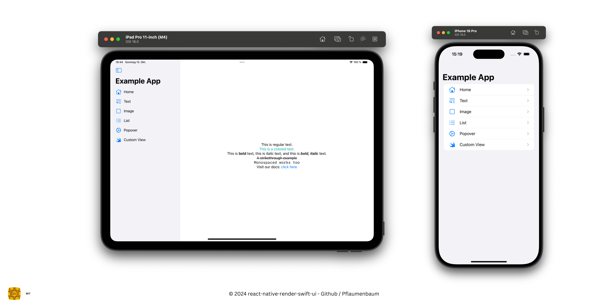

# Example App 



## Get started

#### 1. Clone the github repository

```bash
git clone github.com/Pflaumenbaum/react-native-render-swift-ui.git
```

#### 2. Run NPM install
```bash
npm install
```

#### 3. Navigate to `./example` and run again NPM install
```bash
cd example && npm install
```

#### 3. Run a prebuild
```bash
npx expo prebuild -p ios
```

#### 4. Run `expo run` to install the app to a specific device
```bash
npx expo run ios -d
```

#### 5. 🎉 Congratulations
You've successfully set up the example application on your computer and are now ready to give it a try.